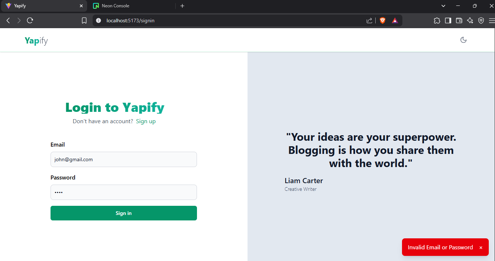
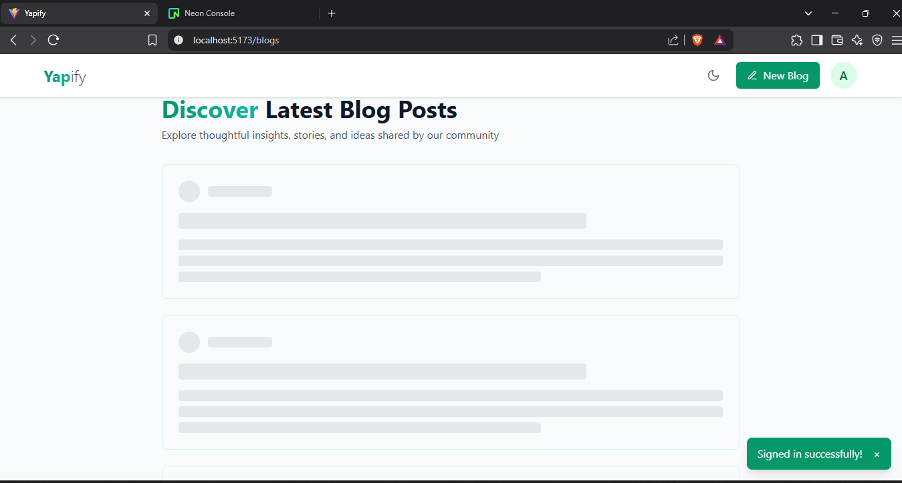
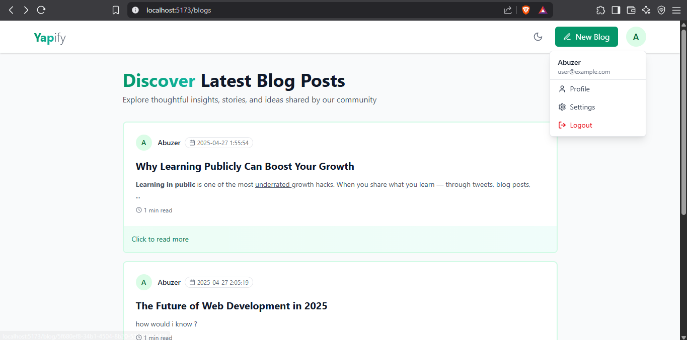
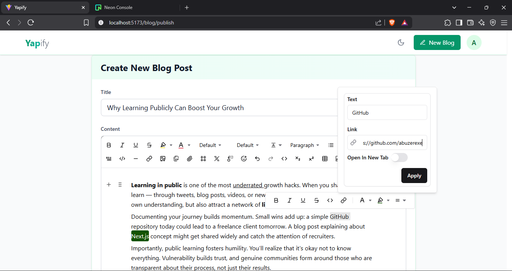
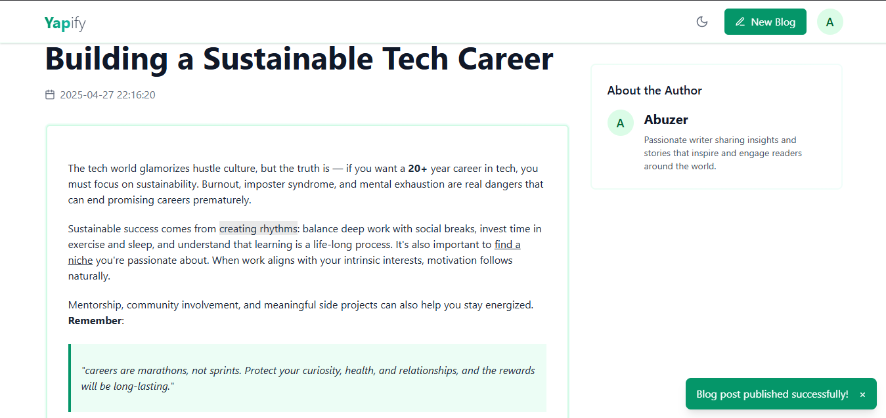
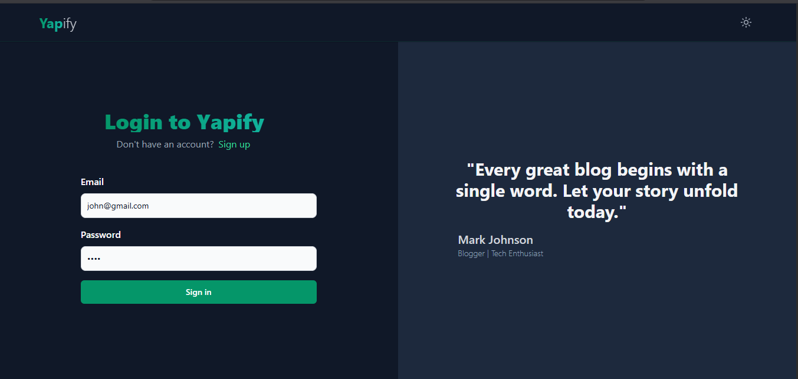

# Yapify - Blogging Platform

Yapify is a blogging platform built with React, Hono, Cloudflare Workers, Zod, Prisma, and Postgres. 

Live Link : https://yapify-flax.vercel.app/

##  The Stack: 

 • React for the frontend

 • Cloudflare Workers with Hono for the backend

 • Zod for validation and frontend type inference

 • TypeScript as the language

 • Prisma as the ORM with connection pooling

 • Postgres as the database

 • JWT for authentication

## Images
### Login Page

### Signup Page

### Skeletons

### Blogs Page

### Creating Blog Page

### Blog Page

### Login Page - Dark Mode

### Blogs Page - Dark Mode


## Setting up locally

This guide will walk you through setting up the project locally.

## Prerequisites

Before you begin, make sure you have the following installed:

- [Node.js](https://nodejs.org/) 


## Clone the repository:

   ```bash
   git clone https://github.com/abuzerexe/Yapify.git
   ```

   
## Backend Setup (Cloudflare Workers)

1. Navigate to the backend folder:

   ```bash
   cd Yapify/backend
   ```

2. Install the necessary dependencies:

   ```bash
   npm install
   ```

3. Add this in the place of vars in your `wrangler.toml` or `wrangler.jsonc` file (also uncomment vars):

   ```toml
   vars = {
     DATABASE_URL = "prisma://your-database-url.example.com/?api_key=",
     JWT_SECRET = "your_jwt_secret"
   }
   ```

4. Create a `.env` file in the root of the backend directory and add Postgres url and prisma Accelerate url:

   ```env
   DIRECT_URL="postgresql://your postgres url"
   DATABASE_URL="prisma://your prisma accelerate url"
   ```

5. Deploy the backend to Cloudflare Workers:

  first you might need to signup/signin in cloudflare using `npx wrangler login` 

   ```bash
   npx wrangler publish
   npx wrangler deploy
   ```
   ## Frontend Setup (React)
   
1. Navigate to the frontend folder:

   ```bash
   cd Yapify/frontend
   ```
   
2. Install dependencies:
   ```bash
   npm install
   ```

3. Create a `.env` file in root of your frontend folder and add the following:
  This would be your deployed cloudflare workers url or you can the local wrangler url using 'npm run dev' in backend
   ```env
   VITE_BACKEND_URL="https://your-backend-url.example.com/api/v1"
   ```

## Prisma Setup and Migrations
To set up Prisma,

1. navigate to the backend directory:

```bash
cd Yapify/backend
```

2. Run the Prisma migration commands to set up your database schema:

```bash
npx prisma migrate dev --name init
```
This will create the necessary tables in your database.

3. After running the migrations, generate Prisma client:

```bash
npx prisma generate --no-engine 
```
if the above command does not work you can try 

```bash
npx prisma generate 
```
Ensure your database is connected and Prisma is working properly by checking the database tables.

## Running the Application Locally

1. Start the backend (or you can use the deployed cloudflare worker url) :

   ```bash
   npm run dev
   ```

2. Start the frontend:

   ```bash
   npm run dev
   ```

The application should now be available at http://localhost:3000 or http://localhost:3000/signin.


## Contributing

If you'd like to contribute to this project, feel free to open an issue or submit a pull request. 

